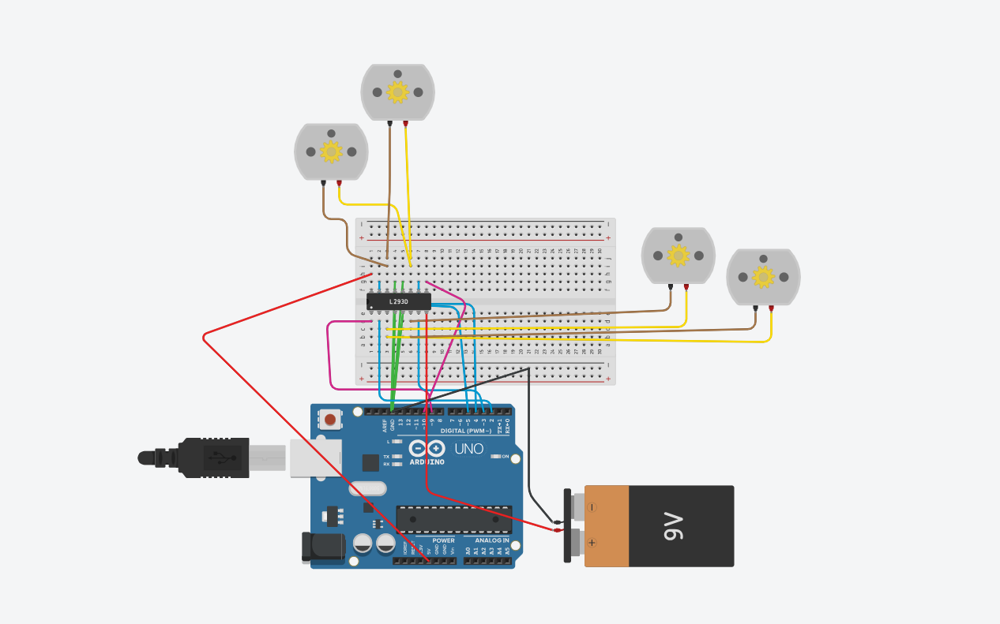
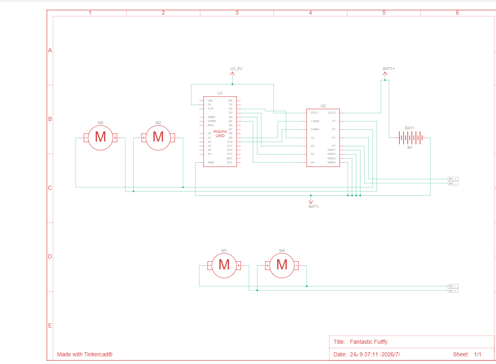
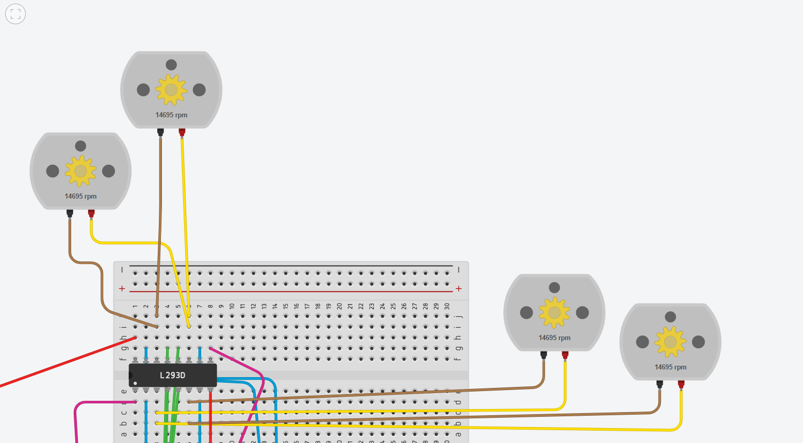
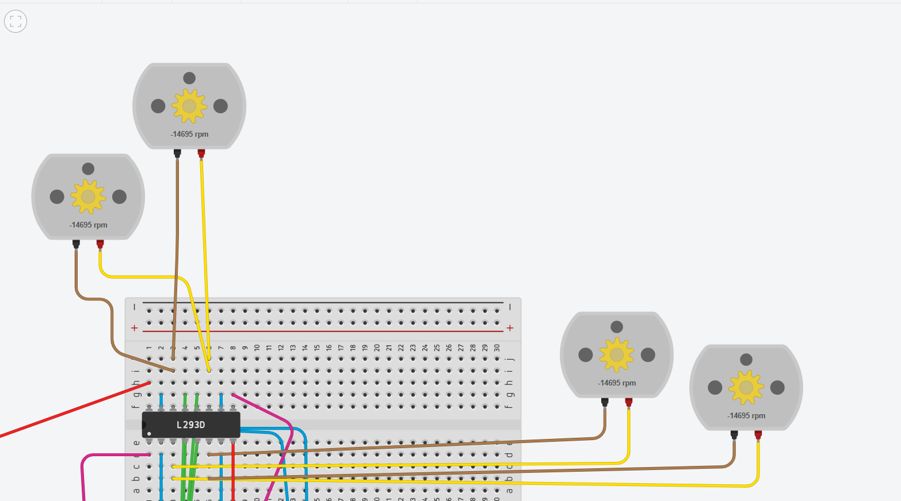
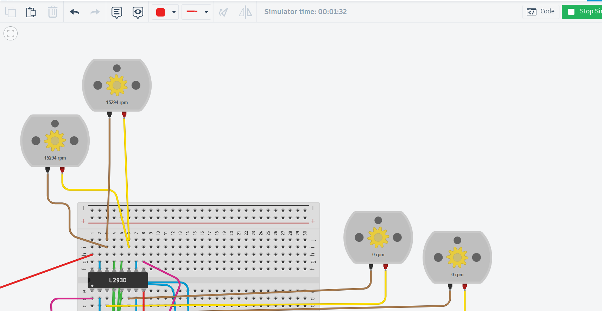
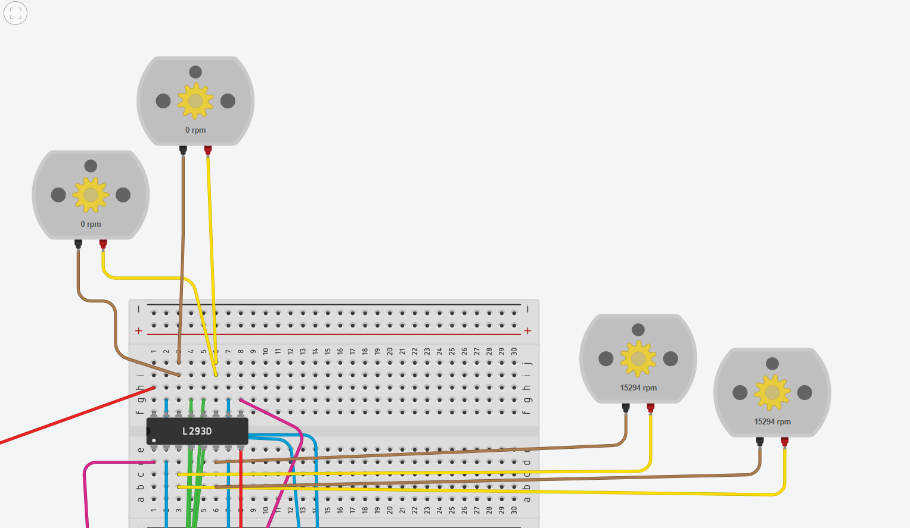

# DC Motor Control using Arduino UNO and L293D

## Overview

This project simulates the wheels of a four-wheel vehicle using four DC motors controlled by an Arduino Uno and the L293D motor driver in Tinkercad.

The simulation performs the following sequence:

- Move Forward for 30 seconds.
- Move Backward for 60 seconds.
- Alternate between Right and Left turns for 60 seconds.
- Stop all motors.

---

## Components

- Arduino Uno
- L293D Motor Driver
- 4 DC Motors
- 9V Battery
- Breadboard
- Jumper Wires

---

## Circuit

### Full Circuit



### Wiring View




### Simulation Results

Forward Movement



Backward Movement



Turn Right Movement



Turn Left Movement




---

## Arduino Code

```cpp
const int ENA = 9;
const int IN1 = 2;
const int IN2 = 3;

const int IN3 = 4;
const int IN4 = 5;
const int ENB = 10;

void setup() {
  pinMode(ENA, OUTPUT);
  pinMode(ENB, OUTPUT);
  pinMode(IN1, OUTPUT);
  pinMode(IN2, OUTPUT);
  pinMode(IN3, OUTPUT);
  pinMode(IN4, OUTPUT);
}

void loop() {
  moveForward();
  delay(30000);

  moveBackward();
  delay(60000);

  for (int i = 0; i < 6; i++) {
    turnRight();
    delay(5000);

    turnLeft();
    delay(5000);
  }

  stopMotors();

  while (1);
}

void moveForward() {
  digitalWrite(ENA, HIGH);
  digitalWrite(ENB, HIGH);

  digitalWrite(IN1, HIGH);
  digitalWrite(IN2, LOW);

  digitalWrite(IN3, HIGH);
  digitalWrite(IN4, LOW);
}

void moveBackward() {
  digitalWrite(ENA, HIGH);
  digitalWrite(ENB, HIGH);

  digitalWrite(IN1, LOW);
  digitalWrite(IN2, HIGH);

  digitalWrite(IN3, LOW);
  digitalWrite(IN4, HIGH);
}

void turnRight() {
  digitalWrite(ENA, HIGH);
  digitalWrite(ENB, HIGH);

  digitalWrite(IN1, LOW);
  digitalWrite(IN2, LOW);

  digitalWrite(IN3, HIGH);
  digitalWrite(IN4, LOW);
}

void turnLeft() {
  digitalWrite(ENA, HIGH);
  digitalWrite(ENB, HIGH);

  digitalWrite(IN1, HIGH);
  digitalWrite(IN2, LOW);

  digitalWrite(IN3, LOW);
  digitalWrite(IN4, LOW);
}

void stopMotors() {
  digitalWrite(ENA, LOW);
  digitalWrite(ENB, LOW);
}
```

---

## Simulation Platform

- Tinkercad Circuits

---

## Author

Tasneem Mohammed
